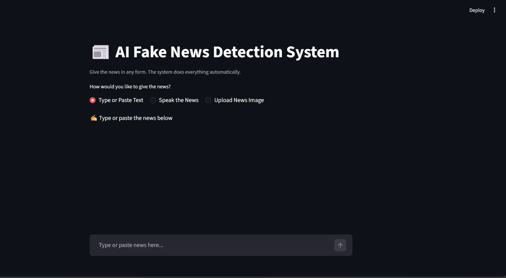
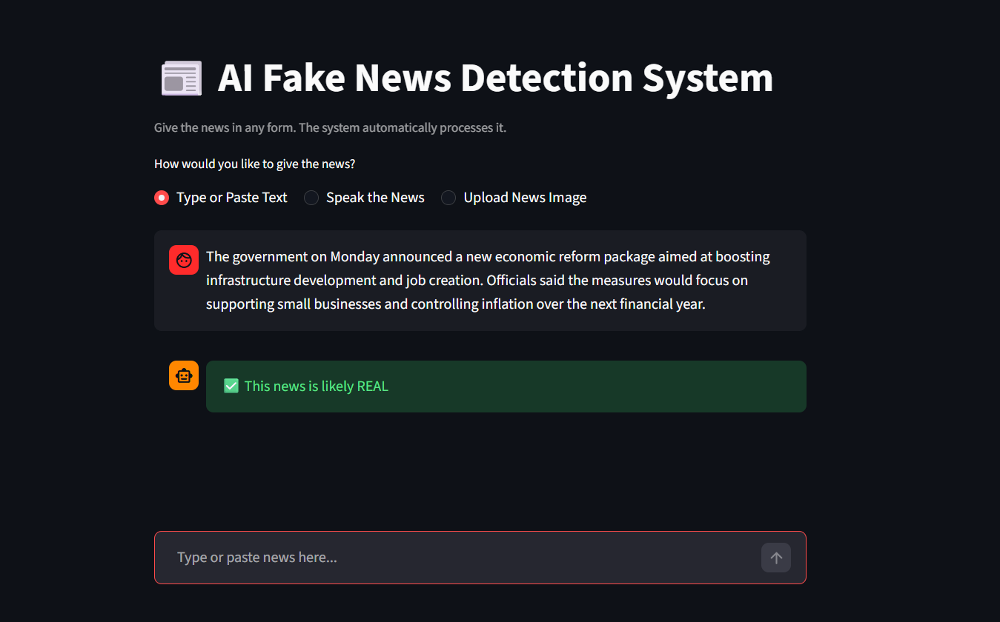
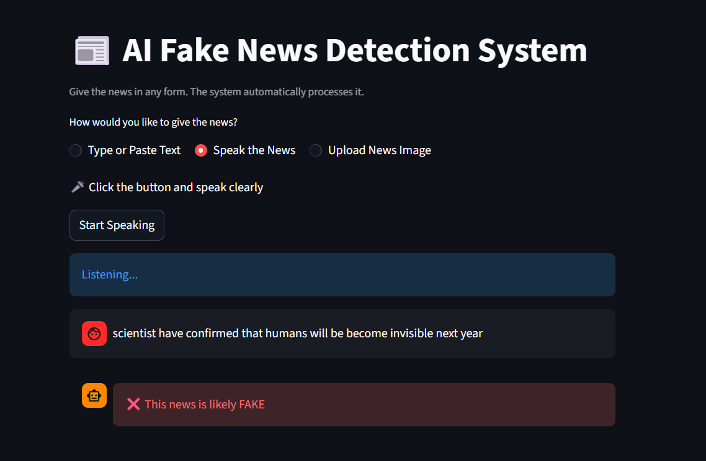
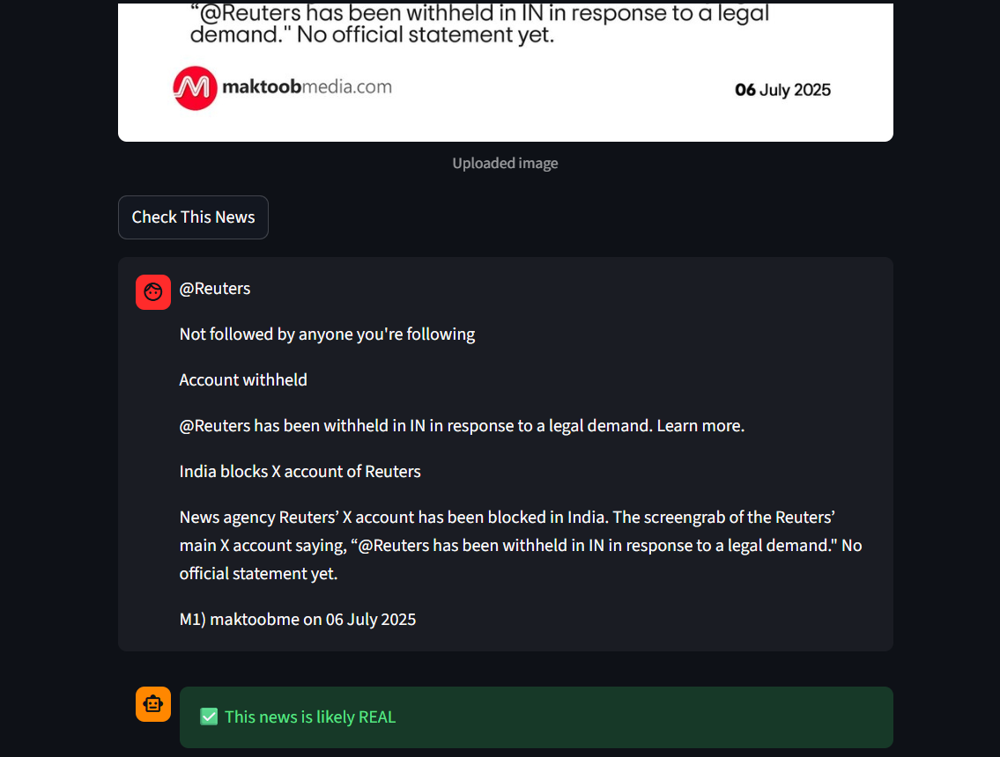

# 📰 AI Fake News Detection System

## 📌 Overview
An AI-powered Fake News Detection System that analyzes news content and predicts whether it is **REAL** or **FAKE**.  
The system accepts news in **Text**, **Voice**, or **Image** form and processes everything automatically using **Machine Learning and NLP**.

A simple and interactive **Streamlit web application** is used to display results in real time.

---

## ✨ Features
- Fake news detection using Machine Learning
- Text-based news verification
- Voice-based news verification (Speech-to-Text)
- Image-based news verification (OCR)
- Automatic NLP preprocessing
- Real-time prediction results
- Clean and user-friendly Streamlit UI

---

## 🏗️ Tech Stack
- Python
- Streamlit
- Scikit-learn
- NLTK
- SpeechRecognition
- Tesseract OCR
- Pillow

## 📂 Project Structure

```text
AI_Fake_News_Detection/
├── data/
│   ├── True.csv
│   └── Fake.csv
│
├── screenshots/
│   ├── text_input.png
│   ├── text_result.png
│   ├── voice_result.png
│   └── image_result.png
│
├── model.py
├── streamlit_app.py
├── model.pkl
├── vectorizer.pkl
├── requirements.txt
├── README.md
└── .gitignore
```

## ⚙️ Setup Instructions

### 1️⃣ Clone Repository
git clone https://github.com/your-username/AI-Fake-News-Detection.git  
cd AI-Fake-News-Detection

### 2️⃣ Install Dependencies
pip install -r requirements.txt

### 3️⃣ Install Tesseract OCR (Windows)
Download and install from:  
https://github.com/UB-Mannheim/tesseract/wiki

---

## ▶️ Run the Application
python -m streamlit run streamlit_app.py

The application will run at:  
http://localhost:8501

---

## 🧪 Input Modes Explained
- **Text Input**: User types or pastes news text
- **Voice Input**: Spoken news is converted to text automatically
- **Image Input**: Text is extracted from images using OCR

---

## 🧠 Machine Learning Workflow
1. News input collection
2. Text cleaning and normalization
3. Stopword removal and lemmatization
4. TF-IDF vectorization
5. ML model prediction
6. Output displayed as REAL or FAKE

---

## 📸 Screenshots

### Home Screen


### Text Input Result


### Voice Input Result


### Image Input Result


---

## 🚀 Future Enhancements
- Improve accuracy using deep learning models
- Support multiple languages
- Add source credibility analysis
- Deploy on cloud for public access

---

## ⚠️ Disclaimer
This project is developed for **educational purposes only**.  
Predictions depend on training data and should not be considered absolute truth.

---

## 📄 License
MIT License

---

## 👤 Author
Medipudi Hari Veera
